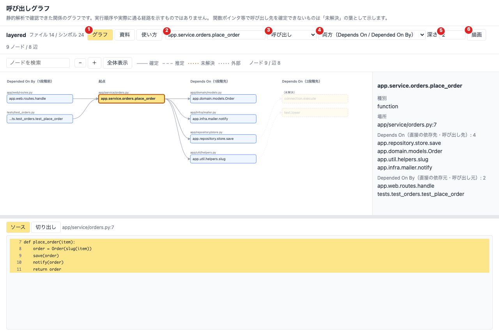
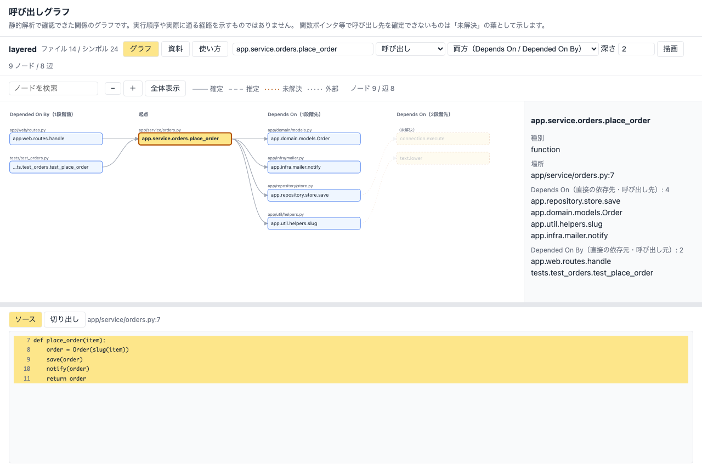
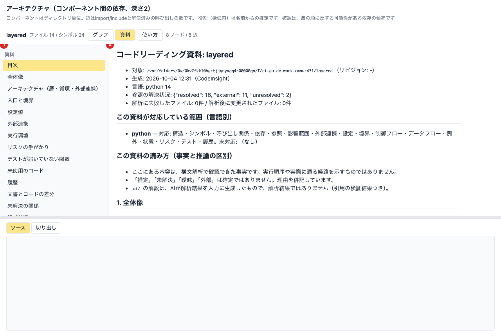

# CodeInsight 運用ガイド

このガイドは、CodeInsight を**使い続ける人・保守する人**のための詳説です。インストールから日常の使い方、対象の追加、AI解説の安全な運用、成果物（コードリーディング資料）の作成、品質の読み方、トラブルシューティング、保守までを、運用の順に説明します。

関連文書: 概要・使い方は [README.md](README.md)、解析方式と限界は [ANALYSIS.md](ANALYSIS.md)、構成は [ARCHITECTURE.md](ARCHITECTURE.md)、要件の充足状況と課題は [REQUIREMENTS.md](REQUIREMENTS.md)、検証結果は [TESTING.md](TESTING.md)、変更履歴は [CHANGELOG.md](CHANGELOG.md)。

## 目次

1. [何をするツールか、何をしないか](#1-何をするツールか何をしないか)
2. [全体像](#2-全体像)
3. [導入](#3-導入)
4. [保存データと設定](#4-保存データと設定)
5. [日常の運用](#5-日常の運用)
6. [対象の言語別の手順](#6-対象の言語別の手順)
7. [コードリーディング資料を作る（`make reading`）](#7-コードリーディング資料を作るmake-reading)
8. [AI解説の運用](#8-ai解説の運用)
9. [安全に運用するための原則](#9-安全に運用するための原則)
10. [結果の読み方（確定・推定・未解決・対応範囲）](#10-結果の読み方確定推定未解決対応範囲)
11. [性能と規模の目安](#11-性能と規模の目安)
12. [トラブルシューティング](#12-トラブルシューティング)
13. [保守・開発の運用](#13-保守開発の運用)
14. [付録](#14-付録)

---

## 1. 何をするツールか、何をしないか

**目的**: 既存のソースコード（主にC言語・Python）を、静的解析で確認できる事実に基づいて読み解くことを支援します。構造・呼び出し関係・依存・データの流れ・失敗時の挙動を、根拠（ファイル・行）つきで示します。

**守る原則**（[AGENTS.md](AGENTS.md) §1）:

| 原則 | 運用上の意味 |
| --- | --- |
| 事実と推論の分離 | 構文解析の結果（事実）と、AIの解説（推論）を別に管理・表示する。確定でないものは「推定」「未解決」「曖昧」「外部」と区別する |
| 根拠へのたどり着き | 結果にはファイル・行・シンボル名が付く。ソースが変更されたら、古い結果として扱う |
| 解析器とAIの責務分離 | 構造の判定は決定論的な解析器が行い、AIは要約・説明だけを担う。AIが使えなくても主要機能は動く |
| 非侵襲 | 対象のソースを変更しない。対象のプログラムを実行しない。ビルドや外部通信は明示的な許可がある場合だけ |

**現時点では行わないこと**（将来の検討対象。条件は [1.1](#11-現時点では行わないことと将来の検討)）: 対象のコードの実行・動的解析、バグの断定、値や条件を考慮した解析、ポインタのエイリアス解析、意味的な検索、設計意図の推測。

### 1.1 現時点では行わないことと将来の検討

次の6項目は、今は提供していませんが、将来の対応を検討しています。いずれも [AGENTS.md](AGENTS.md) の原則（事実と推論の分離、根拠へのたどり着き、解析器とAIの責務分離、非侵襲）の範囲で行う必要があり、**項目ごとに守る条件が異なります**。

| 項目 | 現状 | 将来やる場合に守る条件 | 位置づけ（AGENTS.md） |
| --- | --- | --- | --- |
| 動的解析（実行観測・デバッグ・トレース） | **設計とスタブのみ**（[DYNAMIC_ANALYSIS.md](DYNAMIC_ANALYSIS.md)）。許可の確認と、実行しない計画表示（`dynamic-plan`）だけが動く。対象は実行しない | **利用者の明示的な許可がある場合に限る**。許可なく実行する機能は作らない。実行環境の隔離（別ディレクトリ・権限・時間制限）と、観測結果は静的な事実と区別して表示することを設計に含める | §3.11、§10 の 4、§1.1-4。許可制なら可能 |
| 値や条件を考慮した解析 | 流れ非依存の近似のみ | 到達可能性や値を扱う結果は、確定と推定を区別する。追えない部分を確定として表示しない（§3.7）。まずは単純な定数伝播や分岐条件の矛盾など、限定した範囲から | Phase 5 |
| ポインタのエイリアス解析 | 書き込み先の実体は「追えない」と明示 | 解析が健全でない（取りこぼす・過大に結びつける）場合は、その限界を結果に明示する。確定でない結びつきは「推定」として区別する | Phase 5 |
| 意味的な検索 | 語の一致（名前・パス・docstring・本文、日本語は小さな辞書） | 埋め込みなどを使う場合も、ローカルで完結する構成を既定にし、検索結果が解析結果（事実）ではなく**候補**であることを示す。結果の根拠（一致した箇所）を提示する | 要件外の拡張。AIは解析器の代替にしない（§5.1） |
| バグの断定 | 「手がかり」のみ。断定しない | 構文パターンの一致は断定にしない。**断定してよいのは、健全な解析で証明できる場合に限る**（例: 到達可能な未初期化の使用を、条件込みで証明できた場合）。それ以外は「手がかり」「推定」のまま。AIが断定した内容は事実として保存しない（§10 の 3） | §1.1-1。証明できる範囲を明確にしたうえでのみ |
| 設計意図の推測 | 手がかり（コミットメッセージ・コメント・文書）を示すだけ | コードと履歴から意図を**事実として**推測しない（§3.11）。AIによる解釈を加える場合は、AIの「解説」として、【推論】の印と根拠つきで、解析結果とは別に管理する（§3.8、§1.2-2）。既存のAI解説の枠組みで扱える | §3.11、§3.8 |

どれも、実装する前に AGENTS.md の該当節を確認し、仕様の変更が必要な場合は先に承認を得ます（Cの関数単位の解析で、§9 の注記を変更した例）。優先度の目安と課題は [REQUIREMENTS.md](REQUIREMENTS.md) の「今後の候補」にあります。

---

## 2. 全体像

```
 対象リポジトリ（変更しない）
        │  analyze（走査・構文解析。Python: ast / C: libclang）
        ▼
 解析結果DB（SQLite。対象の外に保存）─────────────┐
   ファイル・シンボル・参照・依存・解析の履歴      │ 解析時の設定（compile_commands の場所など）
        │                                          │
        ├─ 読み取りコマンド（symbols / callers / trace / deps / overview / architecture …）
        ├─ 関数単位の解析（flow / dataflow / state / exceptions / risks / understand）
        │     └ 問い合わせ時に対象のソースを再度構文解析（古い場合は実行しない）
        ├─ グラフ（graph: Mermaid / DOT / JSON / 自己完結HTML）
        ├─ 端末UI（tui）
        ├─ 資料一式（make reading → OUT/README.md）
        └─ AI解説（explain / ask …）→ 解析結果とは別のテーブルに、検証結果つきで保存
```

主なコンポーネント（[ARCHITECTURE.md](ARCHITECTURE.md)）: `analysis/`（言語別の解析器）、`application/`（ユースケース）、`infrastructure/`（SQLite・Git）、`presentation/`（グラフ・TUI）、`ai/`（プロバイダー・文脈・検証）、`cli/`（コマンド）。

---

## 3. 導入

### 3.1 前提

* Python 3.11 以上、[uv](https://docs.astral.sh/uv/)（`uv` が無いと `make` の各ターゲットは「uv が見つかりません」と止まります）。
* C言語の解析には libclang を使います（PyPIの `libclang` パッケージに同梱。Clang本体のインストールは不要）。
* 推奨: `git`（変更履歴・リビジョンの記録に使用。無くても動きます）、`make`。
* 任意: `bear`（autotools系のCで `compile_commands.json` を作るとき）、ローカルLLM（Ollama など。AI解説を使うとき）。

### 3.2 セットアップと動作確認

```bash
make setup      # 依存のインストール（開発用を含む）
make check      # 構文確認 + ruff + mypy + 全テスト（CIと同じ検査）
```

`make check` が通れば、解析・読解・グラフ・TUI・資料生成・AI（スタブ）の基本が動いています。macOS と Linux（Ubuntu 24.04）で確認済みです。

### 3.3 libclang の補足（Cを解析する環境）

pip版の libclang は、コンパイラが暗黙に行うシステムヘッダーの探索（macOS の SDK、`<stdarg.h>` などの組み込みヘッダー）を行いません。CodeInsight が `xcrun --show-sdk-path` や `clang`/`gcc` の設定値の問い合わせ（読み取り専用）で補います。Linux では `gcc` か `clang` が入っていると、標準ヘッダーを見つけられます。

---

## 4. 保存データと設定

### 4.1 場所

| 項目 | 既定 | 変更 |
| --- | --- | --- |
| 解析結果DB | `~/.codeinsight/codeinsight.db` | 各コマンドの `--db`、または環境変数 `CODEINSIGHT_DATA_DIR`（ディレクトリ） |
| AIの設定ファイル | `~/.codeinsight/config.toml` の `[ai]` | `CODEINSIGHT_DATA_DIR` |
| 資料一式（`make reading`） | `reading/<対象名>/` | `OUT=` |

DBは**対象リポジトリの外**に保存されます（対象には何も書き込みません）。登録したプロジェクトが複数ある場合は、`--project`（ID・名前・ルートパス）で指定します。

### 4.2 DBに入るもの

プロジェクト（ルート・Gitリビジョン・除外設定・解析時の `compile_commands.json` の場所）、ファイル（内容ハッシュ・解析状況・解析器のバージョン）、シンボル、参照（解決状態つき）、依存関係、解析の履歴（日時・警告・エラー）、AI解説（別テーブル）。**AIの説明は解析結果として保存されません**。

### 4.3 スキーマとバージョン

現在のスキーマはバージョン5です。旧版のDBは、開いた時に不足する列・テーブルを追加して移行します。**DBがこのバージョンより新しい場合は開けません**（古い CodeInsight で新しいDBを開かない）。DBは使い捨てても構いません（`analyze` で再作成できます）。大切な解析結果は、DBファイルをコピーして保存します。

### 4.4 解析器のバージョンと再解析

解析器のバージョンには、パッケージのバージョンに加えて**解析ロジック（`analysis/` のソース）の指紋**が含まれます。解析ロジックが変わると、ファイルの内容が同じでも `analyze` が再解析します。古いロジックで抽出した結果が、最新の事実として残ることはありません。

### 4.5 除外

`.gitignore` を尊重し、`build`・`dist`・`.venv`・`node_modules`・`__pycache__` などは既定で除外します。シンボリックリンクは、循環や対象外への走査を避けるよう扱います。表示から特定のパスを除くには、多くのコマンドで `--exclude 'tests/*'` が使えます。

---

## 5. 日常の運用

### 5.1 基本の流れ

```bash
# 1. 解析（対象は変更されない）
uv run codeinsight analyze /path/to/repo

# 2. 状況の確認（解析後に変更されたファイルも分かる）
uv run codeinsight status

# 3. 読む
uv run codeinsight overview                  # 全体像
uv run codeinsight architecture              # 構成・層・循環・外部連携
uv run codeinsight understand <関数>         # 8つの問いに答える読解カード
uv run codeinsight tui                       # 端末で構造・ソース・呼び出し関係を行き来する
```

読解カード（`understand`）は、「なぜ存在するか／誰が呼ぶか／何を入力するか／何を変更するか／何を返すか／誰に影響するか／失敗するとどうなるか／なぜ現在の実装か」に、確認できた事実で答えます。理由や意図は推測せず、手がかり（コミットメッセージ・コメント・文書）を示します。

### 5.2 いつ再解析するか

| 状況 | 対応 |
| --- | --- |
| 対象のソースを変更した（コミット・pull 後など） | `analyze` を再実行する。変更のないファイルは再解析されない（インクリメンタル） |
| 結果に「古い」「解析後に変更されています」と出た | `analyze` を再実行する。古い位置のまま関数単位の解析は実行されない |
| CodeInsight を更新した（解析ロジックが変わった） | `analyze` を再実行する（指紋が変わるので自動的に再解析される） |
| `compile_commands.json` を作り直した・場所を変えた | `analyze --compile-commands <ディレクトリ>` を再実行する（設定はDBに保存される） |

### 5.3 探す・追う

```bash
uv run codeinsight symbols --name foo --kind function    # 構文解析に基づくシンボル検索
uv run codeinsight search "text"                         # 全文検索（文字列一致。シンボル検索とは別）
uv run codeinsight def foo                               # 定義
uv run codeinsight refs foo                              # 参照
uv run codeinsight callers foo / callees foo / trace foo --depth 3 / path a b
uv run codeinsight deps [file] [--cycles]                # ファイル・モジュールの依存
uv run codeinsight graph call --root foo --depth 2 --format html -o call.html
uv run codeinsight impact foo / tests foo / unused       # 影響範囲・テストへの到達・未使用
```

同名の定義が複数あるとき（プラットフォーム分岐、複数の `main` など）は、候補が表示されます。`--file` で絞るか、`名前@行番号`（例: `subprocess.Popen._execute_child@1791`）で選びます。

### 5.4 関数の中身を読む

| コマンド | Python | C |
| --- | --- | --- |
| `flow <関数>` | 制御構造・例外処理・リトライ/タイムアウトの手がかり | 制御構造・循環的複雑度・case の落ち込み・エラー値の戻り |
| `dataflow <関数> [変数]` | 定義・使用・伝播、引数を介した呼び出し先/元への追跡 | 定義・使用・伝播、呼び出し先の仮引数への追跡（呼び出し元は未対応） |
| `state <シンボル>` | クラスの属性、モジュール変数の書き換え | グローバル・静的変数の書き込み、引数のポインタを通じた変更 |
| `exceptions <関数>` | 例外の伝播・捕捉・握りつぶし | 終了呼び出し・エラー値の戻り・errno（Cには例外が無い）と、呼び出し先を経由した終了の連鎖（`--depth`） |
| `risks` | 危険な書き方の手がかり | 危険なC標準関数・コマンド実行・書式文字列・割り当て結果の未確認ほか |
| `understand <関数>` | 8つの問い | 8つの問い（項目3〜5・7はCの近似） |

すべて**流れ非依存の近似**です（実行順序・条件・値を考慮しない）。追えない範囲は結果に明示されます。

---

## 6. 対象の言語別の手順

### 6.1 Python

特別な準備は不要です。`analyze` だけで、シンボル・呼び出し・継承・import・型注釈・再エクスポート・型推定による解決が得られます。動的な呼び出し（`getattr`、`importlib`、デコレータによる置換、monkey patching）は、確定せず「未解決」として表示します。

### 6.2 C言語

Cは、**コンパイル設定（`compile_commands.json`）と、生成されるヘッダー（`config.h` など）の有無**で解析できる範囲が大きく変わります。

| 状況 | 解析できるファイルの目安（実測） |
| --- | --- |
| 設定なし（デフォルト引数のみ） | 少ない（gcc libiberty: 10 / 139） |
| `configure` + ビルドの記録 | 大きく増える（libiberty: 131 / 139、解決した参照 4,953） |

CodeInsight は対象に対して `configure` やビルドを**自動実行しません**（対象環境への影響を避けるため）。利用者が別のディレクトリ（out-of-tree）で実行し、記録を渡します。

#### autotools（configure）の場合

```bash
mkdir -p /tmp/build && cd /tmp/build
/path/to/project/configure                 # config.h などをビルドディレクトリに生成
bear -- make -j8                           # compile_commands.json を作る
uv run codeinsight analyze /path/to/project --compile-commands /tmp/build
```

または `make reading-c-build TARGET=/path/to/project BUILD=/tmp/build ALLOW_BUILD=1`（対象の `configure` と `make` を動かすため、`ALLOW_BUILD=1` が必須です。生成済みの `configure` が必要で、`autoreconf` は実行しません）。

#### CMake の場合

```bash
cmake -S /path/to/project -B /tmp/build -DCMAKE_EXPORT_COMPILE_COMMANDS=ON
uv run codeinsight analyze /path/to/project --compile-commands /tmp/build
```

#### CodeInsight が補うこと

* 相対パス（`-I.`）の解決（各コマンドの `directory` 基準）、システムヘッダーの探索。
* ファイルを書き出すオプション（`-o`・`-MMD -MF`）と、警告をエラーに格上げするオプション（`-Werror`）、警告の選択（`-W…`）の除去。解析が対象の環境へ書き込まないため。
* 記録に載っていないファイルは、近隣のコマンドから補間した設定を使い、**「推定」と警告に記録**します。
* ヘッダーは、それを `#include` している記録内のソースの設定と文脈で解析します（`config.h` などを前提とするため）。

#### それでも解析できないもの

libclang が未対応の C23 構文（`_Countof` など）やGCC固有の属性、他OS向けのコード（Win32・MS-DOS）、記録に無い領域。これらは「解析失敗」として記録され、正常に解析したものとして扱われません（結果は `partial`）。

### 6.3 対象に含めないもの

Emacs Lisp（`.el` と、`.org` 内の emacs-lisp ブロック）はシンボル・呼び出し・`require` の依存まで対応しています（名前による推定。制御フロー等の関数内解析は未対応）。TypeScript・Go などは未対応です（将来の言語追加の候補）。PownForge は未コミットの変更が多いため、検証対象から外しています（再開時は、解析時のGitリビジョンと未コミット変更の有無を記録して行います）。

---

## 7. コードリーディング資料を作る（`make reading`）

対象のリポジトリから、読むための資料一式を出力ディレクトリにまとめます。**対象のソースは変更せず**（出力先が対象の中だとエラー）、**対象のプログラムは実行しません**。

```bash
make reading TARGET=../my-repo                         # reading/my-repo/ に資料一式
make reading TARGET=../my-repo OUT=/tmp/out TOP=12     # 出力先・主要な関数の数
make reading TARGET=../c-proj COMPILE_DB=/tmp/build    # Cで compile_commands.json がある場合
make reading TARGET=../my-repo AI_SEND=1                       # AI解説を追記（モデルは環境変数 CODEINSIGHT_AI_MODEL か設定ファイル）
make reading TARGET=../my-repo AI_SEND=1 MODEL=qwen3-coder:latest   # モデルを指定する場合
make reading-clean TARGET=../my-repo                   # 成果物の削除（対象には触れない）
```

### 7.1 変数

| 変数 | 既定 | 意味 |
| --- | --- | --- |
| `TARGET` | （必須） | 対象のディレクトリ |
| `OUT` | `reading/<対象名>` | 出力先（`TARGET` の外）。`~/…` も使える。空白を含むパスは不可 |
| `TOP` | 8 | 主要な関数の選択数（入口・よく呼ばれる・多くを呼ぶ・大きい、各 `TOP` 件の和集合の上位 `2×TOP` 件） |
| `COMPILE_DB` | `BUILD` にあれば自動 | Cの `compile_commands.json` のあるディレクトリ |
| `BUILD` | `OUT/build` | `reading-c-build` のビルド先 |
| `AI_WORKERS` / `AI_NO_REUSE` | 2 / なし | AI解説の並列数、保存済みを再利用しない（7.1.3） |
| `AI_SEND` | なし | `AI_SEND=1` のときだけ、主要な関数のAI解説を `ai/` と PDF の「AIの解説」章に追記する。**ソースの一部をAIへ送信する**ため、既定では作らない |
| `MODEL` | 環境変数 `CODEINSIGHT_AI_MODEL`、設定ファイル | AIのモデル。どれも無ければ、原因を示して AI解説だけスキップする（他の成果物は作る） |
| `UV` | `uv` | uv コマンド |
| `PDF` | （作る） | `PDF=0` で1ファイルのPDFを作らない |

### 7.1.1 1ファイルのPDF

`make reading` は、最後に成果物を1つのPDF（`OUT/<名前>-reading.pdf`）にまとめます。

| 項目 | 内容 |
| --- | --- |
| 構成 | 表紙（対象・リビジョン・言語・解決状況）→ 目次 → 1. 読み方（言語別の対応範囲）→ 2. 全体像（図つき）→ 3. 入口と境界 → 4. 主要な関数の読解カード → 5. 注意して読む箇所 → 6. 背景 → （AI解説があれば）→ 付録（用語・警告・省略したもの） |
| 変換 | 自己完結の印刷用HTMLを組み立て、ヘッドレスのブラウザでPDFにする。HTMLはスクリプトを含まず、Content-Security-Policy で外部通信を遮断する。対象の文字列はすべてエスケープする |
| 図 | graphviz（`dot`）があれば、ノードが 60 個以下の図をSVGで埋め込む。多い図（例: 全体の呼び出しグラフ）は省略し、理由と、対話的な `graphs/*.html` の場所を示す |
| 打ち切り | 各項目は先頭 400 行まで。超えたら、その旨と元のファイルを載せ、付録にも記録する（`reading-report --max-lines` で変更） |
| ブラウザ | 環境変数 `CODEINSIGHT_BROWSER`、macOSのChrome/Chromium/Edge/Brave、PATH の順に探す。無ければ、HTMLを残して理由を示す（`make reading` 自体は失敗にしない） |
| 再生成 | `make reading-pdf OUT=…`、または `codeinsight reading-report --out OUT [--format html] [--output FILE]` |

ブラウザは、CodeInsight が生成したHTMLを描画するためだけに使います（対象のプログラムは実行しません）。一時的なプロファイルを使い、利用者のブラウザの設定・履歴には触れません。

### 7.1.2 AI解説の追記（`AI_SEND=1`）

`AI_SEND=1` を付けると、主要な関数ごとにAI解説（`explain`）を作り、`ai/` と PDF に追記します。

* 送信先は、既定で localhost（Ollama）です。外部の宛先は、`make reading` からは許可しません（`explain --allow-remote` を使う場合は、個別に実行します）。送信内容は `make explain-dry` で事前に確認できます。
* PDFの「AIの解説」章の先頭に、**検証状態の一覧**（対象・モデル・検証済み/一部未確認/未検証・引用の検証できた数）と、注意書き（解析結果ではないこと、「未検証」は事実として扱わないこと、「⚠未確認」の行の意味）を載せます。
* 作れなかった解説は、`logs/ai.log` と画面に原因を示します（例: モデルが指定されていない・AIに接続できない）。AI解説を1件も作れなくても、他の成果物とPDFは作ります。
* 解説は、解析結果とは別に管理され、解析結果のテーブルには保存されません（検証結果つきで、DBの別テーブルに保存）。

### 7.1.3 AI解説の並列化と再開（`AI_WORKERS`）

AI解説は、AIへの問い合わせだけを並列にして生成します（`codeinsight explain-many`。`make reading` が呼びます）。

| 項目 | 内容 |
| --- | --- |
| 並列数 | `AI_WORKERS=N`（既定 2）。ローカルLLM（Ollama）は、同時処理を直列に捌く設定が既定のことがあり、並列にしても速くならない場合がある（`OLLAMA_NUM_PARALLEL` で変えられる）。ホスト型のAPIでは、増やすと速くなる |
| 並列にする範囲 | AIへの問い合わせだけ。根拠の組み立て・検証・DBへの保存は、1つのスレッドで順に行う（SQLiteの競合を避ける） |
| 再開（キャッシュ） | 同じ関数・同じモデル・同じ入力（プロンプトのハッシュ）の解説が保存済みで、根拠のファイルも変わっていなければ、AIへ再送信せず再利用する（検証は再実行する）。中断しても、同じコマンドで、生成済みの分を飛ばして再開できる。`AI_NO_REUSE=1` で、すべて新しく生成する |
| 再試行 | 一時的な失敗（HTTP 429・5xx・時間切れ）は、指数バックオフ（2秒・4秒…）で、最大3回まで再試行する |
| 打ち切り | 認証・権限・モデル/URLの誤り（HTTP 400/401/402/403/404）、接続できない場合は、再試行しても回復しないため、残りを打ち切り、「未処理」として示す。原因を解消して、同じコマンドを再実行する |
| 失敗の扱い | 失敗した解説は保存しない（失敗を成功として残さない）。1件の失敗は、他の件を止めない。結果は「生成・再利用・失敗・未処理」の件数で示す |

単体では `codeinsight explain-many --from-file 一覧 --out-dir ai/ --workers 4 --allow-send --ai-model <モデル>`（一覧は、1行に `名前` または `名前<TAB>ファイル`）。

### 7.2 出力の構成

```
OUT/
├── <名前>-reading.pdf     全体を1つにまとめたPDF（<名前>-reading.html も残る）
├── README.md              目次（読む順序、言語別の対応範囲、取得できなかった項目）
├── overview.txt / .json   全体像
├── architecture.txt       構成・層・循環・外部連携
├── boundaries.txt         入口と境界（CLI・HTTP・イベント・スレッド・非同期）
├── config.txt             環境変数・CLIオプション・設定ファイル
├── externals.txt          外部ライブラリ・システムへの入出力
├── environment.txt        実行環境の前提
├── risks.txt / tests-untested.txt / unused.txt / history.txt / docs-check.txt
├── analysis/              DB・解析のログ・未解決の関係（unresolved.txt）
├── graphs/                call / deps / arch の .html と .mmd
├── functions/             主要な関数の読解カード
├── ai/                    AI解説（MODEL と AI_SEND=1 のときだけ。解析結果とは別）
└── logs/                  取得時の警告・エラー
```

### 7.3 運用上の注意

* 取得できなかった項目は、目次と `logs/` に記録されます。**失敗しても他の項目は作られます**（失敗を隠しません）。
* 目次の「この資料が対応している範囲（言語別）」を必ず確認してください。`0件` は、対応していない言語では「問題なし」を意味しません。
* 再生成は同じコマンドを再実行します（`analyze` は変更のあるファイルだけ再解析します）。
* 同名の関数（複数の `main` など）は、`名前@行番号` と `--file` で特定して読解カードを作ります。

---

## 8. AI解説の運用

AI解説は、静的解析で得た事実とソースを根拠に、AIが生成する**解説**です。解析結果とは別に管理され、検証結果が付きます。

### 8.1 同意（既定では何も送信しない）

| 条件 | 設定 |
| --- | --- |
| ソース・解析結果をAIへ送る | `--allow-send`、または `CODEINSIGHT_AI_ALLOW_SEND=1`、または設定ファイル |
| 送信先が localhost 以外 | さらに `--allow-remote`（`CODEINSIGHT_AI_ALLOW_REMOTE=1`） |
| 生のソース行を送らない | `include_source = false`（事実だけを送る） |
| 送信内容を事前に確認する | `explain <シンボル> --dry-run`（送信しない） |

APIキーは**環境変数 `CODEINSIGHT_AI_API_KEY` のみ**で読みます（設定ファイルに書いても無視され、`ai-status` が警告します）。表示・ログ・エラーメッセージには出ません。

### 8.2 ローカルLLM（推奨の構成）

```bash
uv run codeinsight ai-status --ai-model qwen3-coder:latest        # 接続とモデルの確認（ソースは送らない）
uv run codeinsight explain <関数> --dry-run --ai-model qwen3-coder:latest
uv run codeinsight explain <関数> --allow-send --ai-model qwen3-coder:latest
```

既定の送信先は `http://localhost:11434/v1`（Ollama のOpenAI互換API）です。データはこの計算機の外に出ません。`~/.codeinsight/config.toml` の例:

```toml
[ai]
model = "qwen3-coder:latest"
base_url = "http://localhost:11434/v1"
max_context_chars = 14000
timeout = 600
```

### 8.3 コマンド

`explain`（関数・クラス）、`explain-file`、`explain-path`（呼び出し経路）、`ask "質問"`（関連コードを決定論的に検索して根拠にする。関連コードを特定できなければAIに問い合わせない）、`explanations`（保存済みの一覧・表示。根拠のファイルが変更されていれば「古い」と示す）。

### 8.4 検証状態の読み方

| 状態 | 意味 | 扱い |
| --- | --- | --- |
| 検証済み | 引用がすべて実在・範囲内・鮮度あり、根拠のない主張や存在しない名前が無い | 根拠の確認が機械的に取れた。内容が正しいことの保証ではない |
| 一部未確認 | 引用に誤りはないが、根拠の示されていない記述を含む | ⚠未確認の行を、利用者が確認する |
| 未検証 | 引用の誤り・存在しない名前・根拠なし | 事実として扱わない |

**検証できるのは「示された根拠が存在し、渡した範囲内であること」までです。根拠が主張を実際に裏付けているかは、利用者が確認します。**

### 8.5 評価と品質管理

`uv run codeinsight ai-eval --list`（ケース一覧）、`--allow-send --ai-model <モデル>`（21ケースを採点。引用の妥当性・根拠の再現率・語の再現率・作り話の罠・存在しない名前）、`--repeat N`（出力の揺れを見る）、`--report FILE`（JSON）、`--min-pass-rate`（終了コード5）。モデルやプロンプトを変えたら再評価します（現在の採用モデルは qwen3-coder で、合格率 90%、引用の妥当性 100%。[TESTING.md](TESTING.md)）。`make ai-eval MODEL=... AI_SEND=1` でも実行できます。

---

## 9. 安全に運用するための原則

| 項目 | 運用 |
| --- | --- |
| 対象を変更しない | CodeInsight は対象のソースを書き換えません。`make reading` は出力先が対象の中だとエラーにします |
| 対象を実行しない | プログラムを自動実行しません。`configure`・ビルドは `reading-c-build` で `ALLOW_BUILD=1` を付けたときだけ、別のディレクトリで実行されます |
| 外部通信 | 既定ではありません。明示的に設定したAI接続だけ。外部の送信先は追加の許可が必要 |
| 秘密情報 | APIキーは環境変数のみ。ログ・表示に出ません |
| 信頼できない入力 | 対象のコード・コメント・文書は、AIへの指示ではなく**データ**として扱います（プロンプトに明記） |
| 解析時のファイル書き込み | Cのコンパイル設定から、出力を伴うオプション（`-o`、`-MMD -MF` など）を除去します |
| DBの扱い | DBには対象のソースの要約（シンボル名・docstringの要約・位置）が含まれます。機密のコードを解析したDBは、共有しないでください |

---

## 10. 結果の読み方（確定・推定・未解決・対応範囲）

### 10.1 解決状態

| 表示 | 意味 |
| --- | --- |
| 解決（確定） | プロジェクト内の定義に、静的に確定して対応づけられた |
| 解決（推定） | 候補は特定できたが、オーバーライド・変数の実際の型など、実行時の挙動で変わりうる。理由が付く |
| 曖昧 | 候補が複数ある（同名の定義、プラットフォーム分岐など）。1つを選ばない |
| 未解決 | 静的に確定できない（関数ポインタ、動的呼び出し、型不明）。理由が付く |
| 外部 | 標準ライブラリ・外部ライブラリ・システムヘッダーなど、プロジェクト外 |

静的な呼び出しグラフは、実行順序や実際に通る経路を示しません。グラフ・表示には、この旨が併記されます。

### 10.1d Webビューアー（`serve`）

解析結果を、ローカルのWebビューアーとしてブラウザで見られます。グラフ（呼び出し・制御フロー・ファイル依存・継承・アーキテクチャ。起点を指定すると Depends On / Depended On By の表示）を描画し、**ノードを選ぶとその場でソースを表示**し、**選択した関数を起点にソースを切り出して**（`extract` と同じ内容）Markdownとして保存できます。

```bash
uv run codeinsight serve --project <プロジェクト>            # 表示されたURLをブラウザで開く
uv run codeinsight serve --project <プロジェクト> --port 9000 --open

make analyze TARGET=../my-repo                               # 対象を解析して保存する
make reading TARGET=../my-repo                               # 資料一式を作ったあと、そのままビューアーを起動する（PORT=、OPEN=1。SERVE=0 で起動しない）
make reading-serve TARGET=../my-repo                         # 解析して、ビューアーだけを起動する（資料一式は作らない）
```

`make reading` は、**既定で、資料一式を作ったあとにビューアーを起動します**（`SERVE=0` で起動しない。CI・自動化では `SERVE=0` を付けてください）。解析結果は、`make analyze` と同じDB（`DB=` があればそれ、無ければ既定の `~/.codeinsight/codeinsight.db`）を使います。`make analyze TARGET=…` のあとに `make reading TARGET=…` を実行すると、解析は1回で済みます（`reading` の解析は、変更のないファイルを再解析しません）。上部の種類・方向・深さを変えると、すぐに描き直します。グラフで関数を選ぶと上部の入力にも反映されるので、種類を「制御フロー」に切り替えると、その関数の制御フロー図になります。

* **読み取り専用**で、標準ライブラリだけで動きます（追加の依存なし）。解析の実行・ソースの変更・AIへの送信・外部通信を行うAPIはありません。
* **ローカルからのみ**: `127.0.0.1`（`localhost`・`::1`）にだけバインドします。外部のホストへ公開する指定は、拒否します。
* **トークン**: 起動ごとにランダムなトークンを作り、表示するURLに含めます。ページはトークンを保持してAPIへ送り（URLからは消します）、トークンのないリクエストは拒否します。**URLを共有しないでください**。Hostヘッダーも検査します（DNSリバインディング対策）。GET以外と、CORSは許可しません。
* **境界の移動**: グラフと、下のソース・切り出しの間の境界（灰色の帯）を、ドラッグで上下に動かせます（上下キー、Shift で大きく。ダブルクリックで元に戻る）。高さは、このブラウザに記憶します（記憶できない環境でも動作します）。
* **ソースの取得**は、解析対象のファイル（プロジェクトのルートの中）に限ります。解析後にファイルが変更されている場合は、「古い」と表示します（`/api/refresh` 相当の「再読み込み」は、ページの再読み込みではなく、サーバーの再起動か `analyze` 後の再接続で）。
* APIの一覧: `/api/project`・`/api/symbols`・`/api/graph`・`/api/source`・`/api/extract`・`/api/refresh`。入力は種類・長さ・範囲を検査し、内部のエラーの詳細は応答に出しません。

**画面と操作**（ビューアーの「使い方」にも、同じ内容があります。[ビューアーの使い方](src/codeinsight/web/guide/VIEWER.md)）:



1. 表示の切り替え（グラフ / 資料 / 使い方）、2. 起点にするシンボル、3. グラフの種類、4. 方向、5. 深さ、6. 描画。**種類・方向・深さを変えると、すぐに描き直します**。グラフでノードを選ぶと、下のパネルにソースが出ます。



左が Depended On By（起点に依存している側）、右が Depends On（起点が依存している側）です。

**表示の切り替え**（画面左上の「グラフ / 資料 / 使い方」）:



* **資料**: `make reading` が作った資料（目次・全体像・アーキテクチャ・境界・設定・外部連携・リスク・主要な関数の読解カード・AI解説）を、左の一覧から選んで読みます。Markdownは整形して表示し、本文中の `ファイル:行`（例: `narou_dl/gui/worker.py:227`）は**リンク**になり、クリックすると下のパネルにそのソースが表示されます。資料の出力先がある場合（`make reading`）は、最初にこの画面を開きます。資料の出力先の外やログ・PDF・シンボリックリンクは、読めません。
* **使い方**: ビューアーの操作説明（画像つき）。
* **グラフ**: 上の説明のとおりです。

### 10.1a 呼び出しの範囲のソースを切り出す（`extract`）

呼び出しグラフの範囲（起点の関数と、その呼び出し先・呼び出し元を深さまで）の関数のソースを、根拠位置・解決状態つきの1つの資料にします。コードリーディングの順序つきの読み物として使えます。

```bash
uv run codeinsight extract <関数> --depth 2 -o reading.md --project <プロジェクト>            # 呼び出し先（既定）
uv run codeinsight extract <関数> --callers --depth 2 --project <プロジェクト>               # 呼び出し元
uv run codeinsight extract <関数> --callees --callers --format json --project <プロジェクト>  # 両方・JSON
```

* 目次（関数・場所・関係・確定/推定）、各関数の本体（行番号つき）、たどれなかった呼び出し（未解決・曖昧・外部）の順です。未解決などの呼び出しは、**ソースを出さず**、その旨だけを示します（推測しません）。
* 解析後にファイルが変更されている場合は、行の位置が対応しないため、**ソースを出さず**「古い」と示します。
* 件数（`--max-items`）と、1関数あたりの行数（`--max-lines`）に上限があり、打ち切った場合は明示します。ソースの内容に含まれるバッククォートで、Markdownのコードフェンスから抜け出せないようにしています。

### 10.1b 外部ツールのSARIFを取り込む

SARIFを出力する外部ツール（例: `ruff --output-format sarif`、GCC 13以降の `-fdiagnostics-format=sarif-file` など）の結果を、読み込んで表示できます。**ツールの実行は利用者が行います**（CodeInsightは実行しません。対象のビルドを伴うものは、`ALLOW_BUILD=1` と同じ考え方で、明示的に許可した場合だけ行ってください）。

```bash
uv run codeinsight import-sarif result.sarif --project <プロジェクト>
uv run codeinsight risks --project <プロジェクト>          # 「外部ツールの指摘」が別の区分で出る
uv run codeinsight risks --tool ruff --project <プロジェクト>
uv run codeinsight import-sarif --clear --project <プロジェクト>
```

外部ツールの指摘は、CodeInsight自身の解析結果ではありません。取り込み後にファイルを変更すると「古い」と表示されます。CodeQLの結果は対象にしていません。

### 10.1c 外部のコード索引（SCIP）を取り込む

`scip-python`（Python）や `scip-clang`（C/C++）などが出力する `index.scip` を読み込み、CodeInsight自身の参照解決と比較できます。**索引の生成は利用者が行います**（CodeInsightは実行しません）。Pythonでは仮想環境、Cでは `compile_commands.json` など、各ツールの前提を整えてから実行してください。

```bash
uv run codeinsight import-scip index.scip --project <プロジェクト>
uv run codeinsight compare-scip --project <プロジェクト>      # 一致・食い違い・索引だけが定義を示すもの
uv run codeinsight import-scip --clear --project <プロジェクト>
```

索引は外部ツールの結果で、CodeInsight自身の解析結果ではありません。取り込み後にファイルを変更すると、そのファイルは比較から除かれます。動作を確認したのは scip-python 0.6.6 と scip-clang 0.4.0 の索引です。

`scip-python` は Node.js で動きます。システムを変更せず、利用者のディレクトリに入れる例です。

```bash
npm install --prefix ~/.local/share/codeinsight-tools/scip-python @sourcegraph/scip-python
~/.local/share/codeinsight-tools/scip-python/node_modules/.bin/scip-python index . --project-name <名前> --output index.scip --target-only <ソースのディレクトリ>
```

`scip-clang` は、[GitHubのリリース](https://github.com/sourcegraph/scip-clang/releases)から、実行ファイル（macOS arm64 の `scip-clang-arm64-darwin`、Apache-2.0）を取得し、`shasum -a 256` でリリースのdigestと一致を確認してから、同様にユーザーのディレクトリに置きます。**実行したディレクトリがプロジェクトのルートになり、その下のファイルだけが索引になります**。ソースと `compile_commands.json` の場所が違う場合は、ソースのディレクトリで実行し、`--compdb-path` を指定します。

```bash
cd <ソースのディレクトリ>
scip-clang-arm64-darwin --compdb-path=<compile_commands.json> --index-output-path=index.scip
```

Emacs Lispに対応するSCIPの索引ツールは、確認した範囲では見つかっていません（2026年10月時点）。

生成には、対象のコードは実行されませんが、Pythonの環境（インストール済みの依存）を読みます。出力先は、対象リポジトリの外にしてください。

### 10.2 「0件」「なし」の意味

言語によって対応範囲が異なる機能は、結果に**対象外の言語と件数を注記**します。注記が付いているときの `0件` は、「問題なし」ではなく「検査していない」です。

| 機能 | Python | C | Emacs Lisp |
| --- | --- | --- | --- |
| 構造・呼び出し・依存・参照・影響・履歴 | ○ | ○ | ○（解決は推定） |
| 制御フロー（flow）・状態（state）・エラーの経路（exceptions） | ○ | ○（近似） | ○（近似） |
| データフロー・リスク・読解カード（`understand`） | ○ | ○（近似） | ○（近似。外部副作用の分類は名前による推定） |
| 制御フロー図（`graph flow`） | ○ | ○（近似） | ○（近似） |
| 例外の伝播、呼び出し元の実引数 | ○ | × | ×（exceptions はシグナルの連鎖のみ） |
| 設定値（config）・実行環境（environment）・入口の検出（boundaries） | ○ | config/environment は ×、boundaries は main のみ | × |

### 10.3 近似の限界（誤読しやすい点）

* 流れ非依存: `if` の中の代入が実行されるかは分かりません。値も追いません。
* エイリアス: ポインタや参照を通じた書き込み先の実体は追えません（「追えない」と表示）。
* マクロ: 展開された内部（GNU拡張の文の式を含む）は数えません。条件付きコンパイルで除外された箇所は含みません。
* リスク: 構文パターンによる手がかりです。バグの断定ではなく、意図的な実装の場合があります。`unchecked-alloc` は、確認が別の形の場合は誤検出になります。
* 同名の変数（入れ子のスコープ）は、Cでは同じ名前としてまとめます。

---

## 11. 性能と規模の目安

実測は1台の環境（Apple Silicon、macOS）での単発の値です。外挿は保証しません（[TESTING.md](TESTING.md)）。

| 対象 | ファイル数 | 解析 | ピークメモリ | 再解析（変更なし） |
| --- | --- | --- | --- | --- |
| Python標準ライブラリ | 1,088（約31万行） | 8.0秒 | 313MB | 1.4秒 |
| 同×5（合成） | 5,440（約155万行） | 43.6秒 | 1.1GB | 7.8秒 |
| gcc libiberty（C、設定あり） | 139 | 数秒 | 約100MB | — |

* 問い合わせ時も索引を全てメモリに読み込むため、**メモリが規模の限界**です。
* 遅めのコマンド: `docs-check`（標準ライブラリで約6秒）、Cの `risks`（libiberty全体で約1分、全ファイルを再度構文解析するため）。関数単位の問い合わせは1秒未満〜数秒です。
* 大規模な対象は、`--exclude` で範囲を絞る、またはサブディレクトリを対象に解析してください。

---

## 12. トラブルシューティング

| 症状 | 原因 | 対処 |
| --- | --- | --- |
| `make` が `uv が見つかりません` で止まる | `uv` が未インストール | uv をインストールする、または `UV=...` で指定 |
| `make reading` が `Error 127` | 必要なコマンドが無い（以前は `python3` 依存）。現在は `uv` 経由で解消済み | `uv` があることを確認。`bear` は `reading-c-build` のときだけ必要 |
| GitHub Actions で `make` のコマンドが `true` になる | 環境変数 `CI=true` と Makefile の変数名が衝突していた（修正済み。変数は `CODEINSIGHT`） | 最新版を使う |
| `データベースが見つかりません` | 未解析 | 先に `analyze` を実行する。`--db` の指定を確認 |
| `DBのスキーマ(version N)がこのバージョンより新しいため開けません` | 新しい CodeInsight で作ったDBを古い版で開いた | CodeInsight を更新する、またはDBを作り直す |
| 「解析後に変更されています。再解析してください」 | 対象のファイルが解析後に変更された | `analyze` を再実行する |
| 複数のプロジェクトがあり選べない | `--project` が必要 | `--project <名前|ID|パス>` を指定する |
| 複数のシンボルに一致する | 同名の定義が複数 | `--file`、または `名前@行番号` で絞る |
| Cで `'config.h' file not found` が多数 | 生成ヘッダーが無い | [6.2](#62-c言語) の手順で configure + ビルドの記録を作り、`--compile-commands` で渡す |
| Cで `'stdio.h' file not found` | システムヘッダーを検出できない | Linux: `gcc` か `clang` を入れる。macOS: Xcode Command Line Tools を確認（`xcrun --show-sdk-path`） |
| Cで解析が `partial`（失敗ファイルあり） | 他OS向けコード、未対応構文、記録に無い領域 | 失敗の理由は `analyze` の出力と `status`。「正常に解析した」ものとは扱われない。必要なら記録を拡充する |
| Cの `risks` / 関数解析が「解析できません（libclangのバージョン差）」 | Python版libclangが知らないASTノード | 該当ファイルは検査済みとして扱われない。libclang パッケージを更新して再試行 |
| `flow` などが「定義をソースから特定できません」 | 条件付きコンパイルで除外された定義、またはヘッダー内の定義で取り込み元が無い | 記録を拡充する、または別の定義を指定する |
| PDFを作れなかった（「ブラウザが見つかりません」） | Chrome・Chromium・Edge が無い | 入れる、または `CODEINSIGHT_BROWSER` で指定する。HTMLは残るので、ブラウザで開いて「PDFとして保存」もできる |
| PDFの図が「省略」になる | ノードが多い、または graphviz（`dot`）が無い | 対話的な `graphs/*.html` を使う。`reading-report --max-graph-nodes` で上限を上げられる |
| `tui` が「端末でのみ使えます」 | 標準入出力が端末でない | 対話的な端末で実行する |
| AIが「送信する許可が設定されていません」 | 既定では送信しない | 内容を `--dry-run` で確認し、よければ `--allow-send` |
| AIが「接続できません」 | Ollama が起動していない・モデルが無い | `ai-status` で確認。AI以外の機能には影響しない |
| 「関連するコードを特定できませんでした」（`ask`） | 質問の語が、名前・パス・docstring・本文と一致しない | 識別子やファイル名を含めて質問する（辞書にない言い換えは見つからない） |
| `0件` なのに不安 | 対応していない言語かもしれない | 結果末尾の注記と、目次の言語別の対応範囲を確認する |

---

## 13. 保守・開発の運用

### 13.1 日常の検査

```bash
make check        # 構文 + ruff + mypy + 全テスト（CIと同じ）
make lint         # ruff と mypy のみ
make test-fast    # 最初の失敗で止める
```

* 変更には対応する自動テストを付け、既存のテストが通ることを確認します。失敗したテストの期待値だけを書き換えない（実装との整合を確認する）。
* CI（GitHub Actions）は、Python 3.11〜3.13 のテスト、ruff、mypy。`setup-uv` は固定バージョンのため、更新は手動です。実行環境は `ubuntu-24.04` に固定しています（`ubuntu-latest` は2026-10-19にUbuntu 26へ移るため）。Ubuntu 26へ上げるときは、libclangの標準ヘッダー検出（C言語のテスト）を含め、CIの結果を確認してください。

### 13.2 ドキュメントの更新

設計と実装に差異が出たら、実装の実態を確認したうえで更新します。`docs-check` で、文書に書かれた識別子・オプションが実装にあるかを機械的に照合できます（概念的な用語は誤検出になります）。

| 文書 | 更新するとき |
| --- | --- |
| README.md | 使い方・コマンドの追加 |
| ANALYSIS.md | 解析方式・制約の変更 |
| ARCHITECTURE.md | モジュール構成・スキーマの変更 |
| REQUIREMENTS.md | 要件の充足状況、課題一覧 |
| TESTING.md | テスト・検証結果（実測は日付と条件を添える） |
| CHANGELOG.md | 変更の履歴（追加・修正・既知の制約） |
| OPERATIONS.md（本書） | 運用手順・トラブルシューティングの変更 |

### 13.3 実機・CIで見つかった不具合の扱い

不具合を直したら、**回帰テストを足し**、[TESTING.md](TESTING.md) の対応表（見つかった場所・不具合・修正・回帰テスト）に追記します。実機の検証（libiberty・emacs など）は、手順と結果を日付つきで記録します。

### 13.4 解析ロジックの変更

`analysis/` を変更すると、解析器の指紋が変わり、利用者のDBは次回の `analyze` で再解析されます。精度に影響する変更は、独立したオラクル（素朴な `ast` による直接呼び出しの検証、Cの制御フローの汎用AST走査との比較）で再検証し、結果を記録します。

### 13.5 リリース前のチェックリスト

- [ ] `make check` が通る（macOS）。Linux（Docker など）でも全テストが通る
- [ ] CI が成功している
- [ ] 実機の対象（Python・C）で `make reading` が完走する
- [ ] AI評価（`ai-eval`）を、採用モデルで再測定し、記録した
- [ ] ドキュメント（特に TESTING・CHANGELOG・REQUIREMENTS の課題一覧）が実装と一致している
- [ ] 対象リポジトリに変更が入っていない（`git status`）

---

## 14. 付録

### 14.1 コマンド一覧（カテゴリ別）

| カテゴリ | コマンド |
| --- | --- |
| 解析・状況 | `analyze`, `status`, `unresolved` |
| 検索・定義・参照 | `symbols`, `tree`, `search`, `def`, `refs`, `show`, `describe` |
| 呼び出し・依存 | `callers`, `callees`, `trace`, `path`, `deps`, `graph`, `tui` |
| 全体像 | `overview`, `architecture`, `boundaries`, `externals`, `effects`, `config`, `environment` |
| 関数を読む | `understand`, `flow`, `dataflow`, `state`, `exceptions`, `risks` |
| 品質・履歴 | `history`, `tests`, `impact`, `unused`, `docs-check` |
| AI | `explain`, `explain-many`（複数を並列・再開つき）, `explain-file`, `explain-path`, `ask`, `explanations`, `ai-status`, `ai-eval` |
| 資料の1ファイル化 | `reading-report` |
| 動的解析（スタブ） | `dynamic-plan`（実行しない計画の表示）, `dynamic-run`（許可の確認のみ。実行は未実装） |

共通オプション: `--db`, `--project`, `--format {text,json}`, `--exclude GLOB`。詳細は各コマンドの `--help`。

### 14.2 `make` ターゲット

| ターゲット | 用途 |
| --- | --- |
| `setup` / `check` / `test` / `lint` / `clean` | 開発 |
| `analyze` / `status` / `overview` / `architecture` / `unresolved` / `understand` | 解析結果の確認（`TARGET`・`NAME`・`DB`・`PROJECT`） |
| `ai-status` / `explain-dry` / `explain` / `ai-eval` | AI（`MODEL`・`AI_SEND=1`） |
| `reading` / `reading-pdf` / `reading-c-build` / `reading-clean` | コードリーディング資料（[7](#7-コードリーディング資料を作るmake-reading)） |

### 14.3 環境変数

| 変数 | 用途 |
| --- | --- |
| `CODEINSIGHT_DATA_DIR` | DB・設定ファイルの場所 |
| `CODEINSIGHT_AI_ALLOW_SEND` / `_ALLOW_REMOTE` | AIへの送信の許可 |
| `CODEINSIGHT_AI_BASE_URL` / `_MODEL` | 送信先・モデル |
| `CODEINSIGHT_AI_API_KEY` | APIキー（環境変数のみ） |
| `CODEINSIGHT_AI_TIMEOUT` / `_MAX_CONTEXT` | タイムアウト・文脈の大きさ |

### 14.4 ファイル構成

```
src/codeinsight/   analysis/ application/ domain/ infrastructure/ presentation/ ai/ cli/
tests/             単体・結合テスト、tests/fixtures/（解析対象のサンプル）
eval/              ai_cases.toml（AI評価）、retrieval_cases.toml（質問の検索の評価）
.github/workflows/ ci.yml
Makefile           開発・解析・資料生成のタスク
```

### 14.5 用語

| 用語 | 意味 |
| --- | --- |
| 流れ非依存 | 実行順序・条件・値を考慮しない近似 |
| 解決状態 | 解決 / 曖昧 / 未解決 / 外部 |
| 確からしさ | 確定 / 推定（解決の場合のみ） |
| 古い結果 | 解析後に対象のファイルが変更された（内容ハッシュで検出） |
| out-of-tree ビルド | ソースとは別のディレクトリでビルドする方式（生成物がソースを汚さない） |
| 指紋 | 解析ロジックのソースから求めた識別子。変わると再解析される |
| 手がかり | バグの断定ではなく、確認すべき箇所の候補 |
