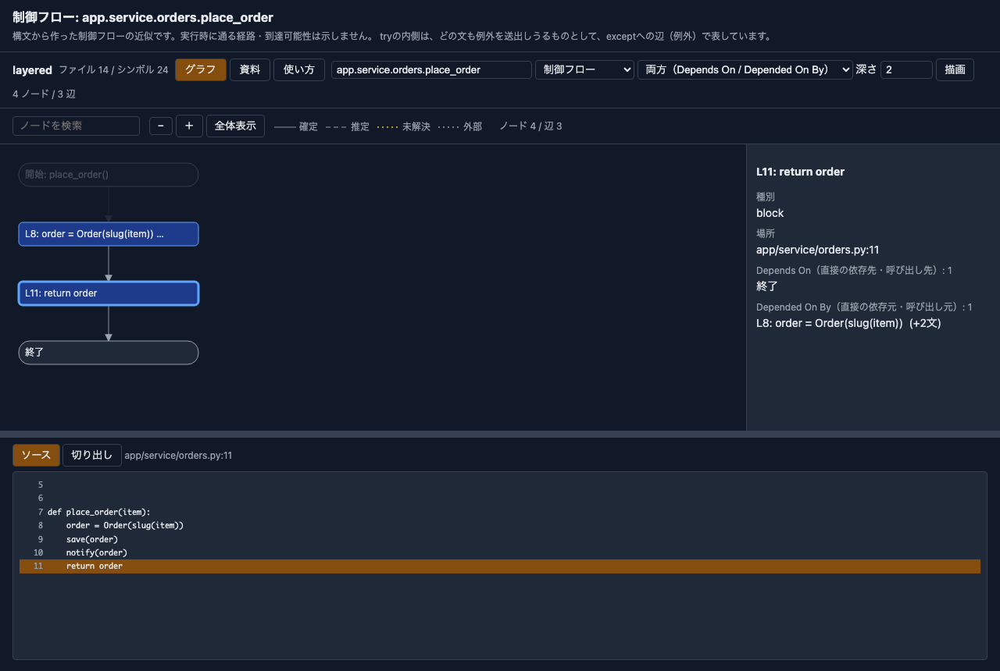
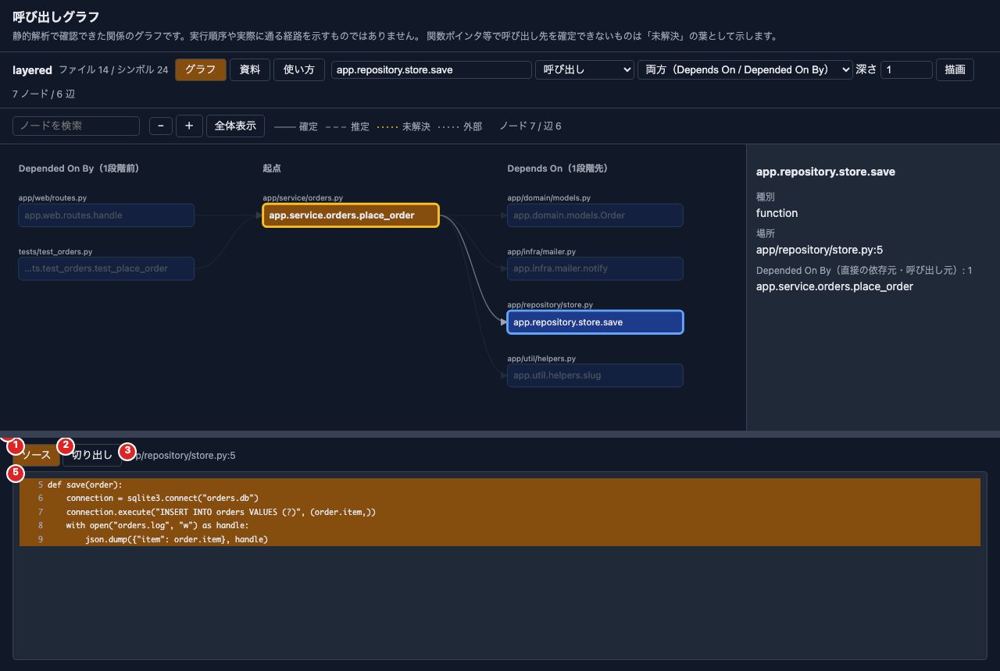
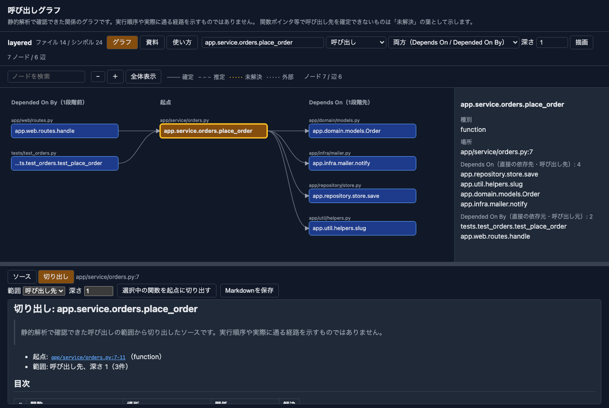
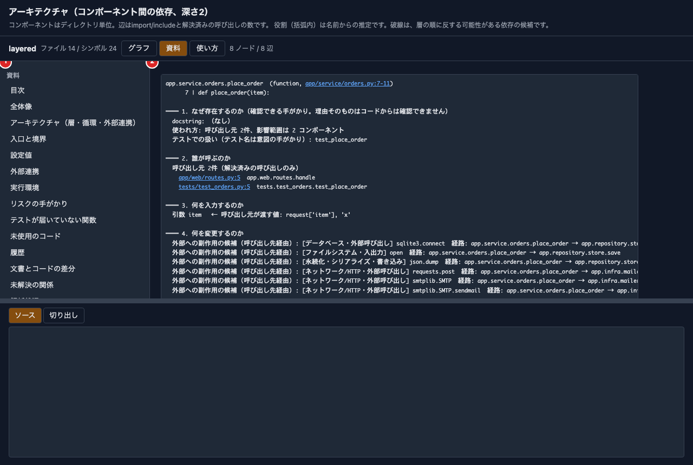

# ビューアーの使い方

CodeInsight のビューアーは、解析結果を、ブラウザで読むための画面です。**読み取り専用**で、解析の実行・ソースの変更・外部への送信は行いません。画面の左上の「グラフ」「資料」「使い方」で、表示を切り替えます。

> 静的解析で確認できた関係を表示します。実行順序や、実際に通る経路を示すものではありません。解析後にファイルを変更した場合は、「古い」と表示します。

## 起動する

| やりたいこと | コマンド |
| --- | --- |
| 解析→資料一式→ビューアーを、まとめて（最も簡単） | `make reading TARGET=../my-repo`（`SERVE=0` で起動しない。事前の `make analyze` は不要） |
| すでに解析・資料がある対象のビューアーだけ | `make reading-serve TARGET=../my-repo`、または `uv run codeinsight serve --project <プロジェクト>`（`--port`、`--reading-dir <資料の出力先>`） |
| 解析だけ | `make analyze TARGET=../my-repo`（任意。`reading` も最初に同じ解析を同じDBへ行い、変更のないファイルは再解析しません） |
| Docker（AIはホストの Ollama） | `TARGET=/絶対パス/my-repo docker compose up --build`、または `make docker-up TARGET=../my-repo` |

表示されたURL（`http://127.0.0.1:…/?token=…`）をブラウザで開きます。URLには、**起動ごとのトークン**が含まれます。**共有しないでください**。

* トークンは、**サーバーを起動するたびに変わります**（再起動・`docker compose up` のやり直しでも）。再読み込みや、履歴・ブックマークのURLにはトークンがないため、「開けません（401）」と出ます。そのときは、起動したターミナル（Docker は `docker compose logs codeinsight`）に出た**最新のURL**を開いてください。
* 毎回同じURLで開きたい場合は、環境変数 `CODEINSIGHT_VIEWER_TOKEN`（16文字以上の英数字と `-` `_`。Docker は `.env` の `VIEWER_TOKEN`）で固定できます。
* ポート 8765 が使用中の場合は、`PORT=` や `--port`（`0` で空きポート）で変えるか、古い `serve` を止めてください（Docker は、ホスト側とコンテナ側のポートを同じ値にします）。
* Docker の詳細は、OPERATIONS.md の「Docker で動かす」を参照してください。

## 1. 上部の操作（グラフ）

| 番号 | 部品 | 使い方 |
| --- | --- | --- |
| 1 | グラフ / 資料 / 使い方 | 表示を切り替えます。 |
| 2 | シンボルの入力 | 起点にする関数・クラスの名前（修飾名）を入力します。2文字以上で候補が出ます。グラフでノードを選ぶと、ここにも入ります。 |
| 3 | 種類 | 呼び出し・制御フロー・ファイル依存・継承・アーキテクチャ。**変えるとすぐに描き直します**。 |
| 4 | 方向 | 「両方」は、起点が依存している側（Depends On）と、起点に依存している側（Depended On By）の両方を出します。 |
| 5 | 深さ | 起点から、何段階たどるか。数値を変えると、少し待って描き直します。 |
| 6 | 描画 | 同じ設定で、描き直します。 |

* 「制御フロー」は、1つの関数の中の図です。方向と深さは効きません。
* 左上の「ノード / 辺」の数は、描いたグラフの大きさです。大きすぎる場合（2000ノード超）は、起点と深さで絞り込んでください。

## 2. Depends On / Depended On By

起点を中央（黄色）に、**左に Depended On By**（起点に依存している側。呼び出し元・依存元）、**右に Depends On**（起点が依存している側。呼び出し先・依存先）を、距離ごとの列に並べます。ノードの上の小さな文字は、そのノードがあるファイルです（同じファイルのノードがまとまります）。

* 実線は確定、破線は推定、点線は未解決・外部です。
* ノードを選ぶと、つながる辺が強調され、右のパネルに、直接の依存先と依存元が一覧されます。
* ノードの検索欄で、ノードを探せます。「−」「＋」「全体表示」で、拡大・縮小ができます。

## 3. 制御フロー図

種類を「制御フロー」にして、関数を指定すると、その関数の中の分岐・繰り返し・例外（Emacs Lispではシグナル）・終了を、図にします（Python・C・Emacs Lisp）。黄色は分岐、角の丸いものは開始・終了です。構文からの近似で、実行時に通る経路を示すものではありません。

## 4. ソースを読む

| 番号 | 部品 | 使い方 |
| --- | --- | --- |
| 1 | ソース | 選んだノードの本体を表示します。 |
| 2 | 切り出し | 次の節を参照してください。 |
| 3 | 場所 | 選んだノードの `ファイル:行` です。解析後にファイルが変わっていると、注記が出ます。 |
| 4 | 境界 | ドラッグで、グラフとパネルの高さを変えられます（上下キーでも。ダブルクリックで元に戻る）。 |
| 5 | ソース | 黄色の行が、ノードに対応する範囲です。制御フロー図のブロックでは、該当行と前後6行を表示します。 |

## 5. 呼び出しの範囲のソースを切り出す

「切り出し」を開き、範囲（呼び出し先・呼び出し元・両方）と深さを選んで、**「選択中の関数を起点に切り出す」**を押します。選んだ関数と、呼び出しの範囲の関数の本体が、目次・根拠位置（`ファイル:行`）・確定/推定つきで表示されます。表示は、Markdownを整形した（HTMLの）画面で、`ファイル:行` はクリックでソースを開けます。「Markdownを保存」で、Markdownのファイルにできます（`extract` コマンドと同じ内容です）。

* 未解決・曖昧・外部の呼び出しは、ソースを出さず、一覧にします（推測しません）。
* 解析後に変更されたファイルは、行の位置が合わないため、ソースを出さず「古い」と示します。

## 6. 資料を読む

| 番号 | 部品 | 使い方 |
| --- | --- | --- |
| 1 | 一覧 | 目次・全体像・アーキテクチャ・入口と境界・設定値・外部連携・リスク・主要な関数の読解カード・AI解説を選びます。 |
| 2 | 本文 | Markdownは整形して表示します。 |

上の「資料」で、`make reading` が作った資料を開きます（資料があるときは、最初にこの画面を開きます）。

本文の中の `ファイル:行`（例: `app/service/orders.py:7-11`）は**リンク**です。クリックすると、「グラフ」に戻らずに、下のパネルにそのソースを表示します。AI解説は、解析結果ではなく、AIが作ったものです（根拠の検証状態が付いています）。

## 安全について

* `127.0.0.1` のみで待ち受け、外部からは接続できません。トークンと Host の検査があり、トークンのないリクエストは拒否します。Docker では、コンテナの中は全てのインターフェースで待ち受けますが、ホスト側への公開は `127.0.0.1` だけです。
* 読み取り専用です。資料は、出力先にある一覧のものだけを読みます（ログ・PDF・シンボリックリンク・出力先の外は読みません）。
* 画面に表示する文字列（ソース・シンボル名・資料）は、解析対象由来の内容です。HTMLとしては解釈しません。外部のURLは、リンクにしません。
